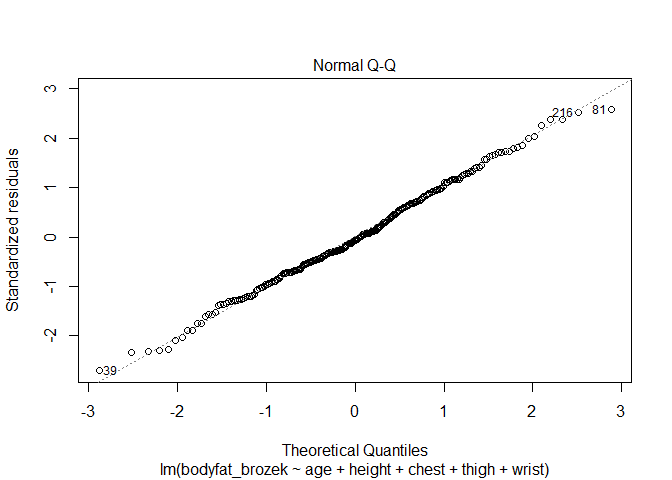
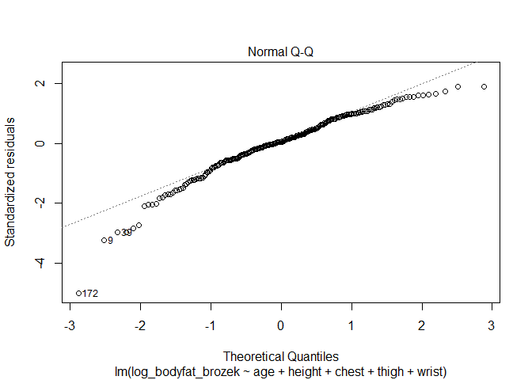
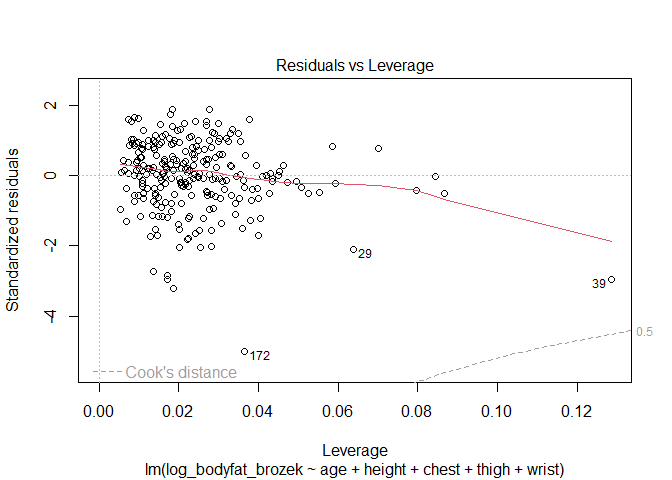
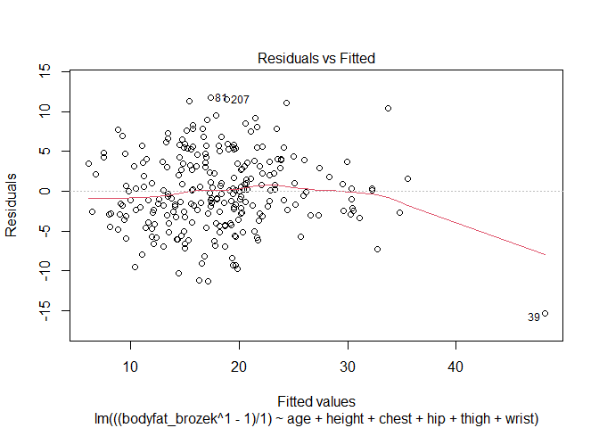
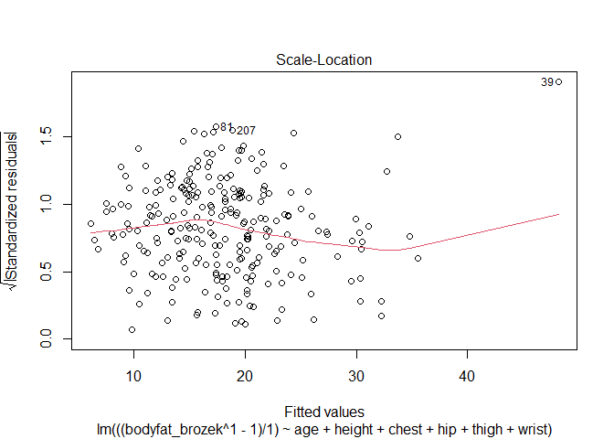
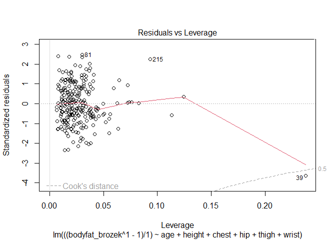
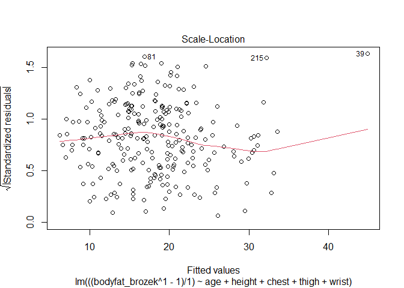
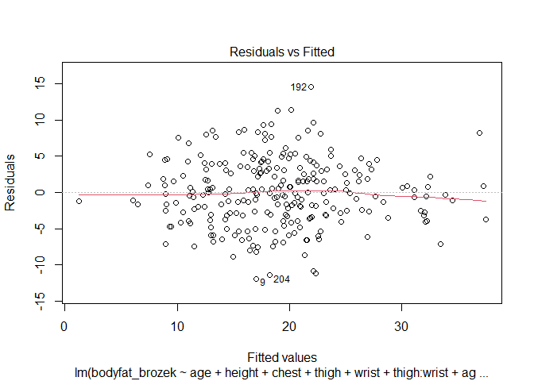

FinalProject
================
Group 30
2022-11-28

## R Markdown

### Appendix 1: Distribution of Data

``` r
Body_df = readxl::read_excel("data/body_density_data.xlsx")
summary(Body_df)
```

    ##        id         bodyfat_brozek   bodyfat_siri    body_density  
    ##  Min.   :  1.00   Min.   : 0.00   Min.   : 0.00   Min.   :0.995  
    ##  1st Qu.: 63.75   1st Qu.:12.80   1st Qu.:12.47   1st Qu.:1.041  
    ##  Median :126.50   Median :19.00   Median :19.20   Median :1.055  
    ##  Mean   :126.50   Mean   :18.94   Mean   :19.15   Mean   :1.056  
    ##  3rd Qu.:189.25   3rd Qu.:24.60   3rd Qu.:25.30   3rd Qu.:1.070  
    ##  Max.   :252.00   Max.   :45.10   Max.   :47.50   Max.   :1.109  
    ##       age            weight          height           neck      
    ##  Min.   :22.00   Min.   :118.5   Min.   :64.00   Min.   :31.10  
    ##  1st Qu.:35.75   1st Qu.:159.0   1st Qu.:68.25   1st Qu.:36.40  
    ##  Median :43.00   Median :176.5   Median :70.00   Median :38.00  
    ##  Mean   :44.88   Mean   :178.9   Mean   :70.31   Mean   :37.99  
    ##  3rd Qu.:54.00   3rd Qu.:197.0   3rd Qu.:72.25   3rd Qu.:39.42  
    ##  Max.   :81.00   Max.   :363.1   Max.   :77.75   Max.   :51.20  
    ##      chest           abdomen            hip            thigh      
    ##  Min.   : 79.30   Min.   : 69.40   Min.   : 85.0   Min.   :47.20  
    ##  1st Qu.: 94.35   1st Qu.: 84.58   1st Qu.: 95.5   1st Qu.:56.00  
    ##  Median : 99.65   Median : 90.95   Median : 99.3   Median :59.00  
    ##  Mean   :100.82   Mean   : 92.56   Mean   : 99.9   Mean   :59.41  
    ##  3rd Qu.:105.38   3rd Qu.: 99.33   3rd Qu.:103.5   3rd Qu.:62.35  
    ##  Max.   :136.20   Max.   :148.10   Max.   :147.7   Max.   :87.30  
    ##       knee           ankle          bicep          forearm          wrist      
    ##  Min.   :33.00   Min.   :19.1   Min.   :24.80   Min.   :21.00   Min.   :15.80  
    ##  1st Qu.:36.98   1st Qu.:22.0   1st Qu.:30.20   1st Qu.:27.30   1st Qu.:17.60  
    ##  Median :38.50   Median :22.8   Median :32.05   Median :28.70   Median :18.30  
    ##  Mean   :38.59   Mean   :23.1   Mean   :32.27   Mean   :28.66   Mean   :18.23  
    ##  3rd Qu.:39.92   3rd Qu.:24.0   3rd Qu.:34.33   3rd Qu.:30.00   3rd Qu.:18.80  
    ##  Max.   :49.10   Max.   :33.9   Max.   :45.00   Max.   :34.90   Max.   :21.40

``` r
#the data is all continuous so histogram

ggplot(Body_df, aes(x=bodyfat_brozek)) + 
 geom_histogram(aes(y=..density..), colour="black", fill="white",binwidth = 1)+
 geom_density(alpha=.2)+
 labs(title="Distributions of body fat measured in Brozek method")
```

    ## Warning: The dot-dot notation (`..density..`) was deprecated in ggplot2 3.4.0.
    ## ℹ Please use `after_stat(density)` instead.

<!-- -->

``` r
#define column names
colnames = colnames(Body_df)

# Predictor:
for (i in 5:length(colnames)){
  plot = 
ggplot(Body_df, aes_string(x=colnames[i])) + 
 geom_histogram(aes(y=..density..), colour="black", fill="white",binwidth = 1)+
 geom_density(alpha=.2)+
 labs(title=sprintf("Distributions of %s", colnames[i]) )
  
  print(plot)
}
```

    ## Warning: `aes_string()` was deprecated in ggplot2 3.0.0.
    ## ℹ Please use tidy evaluation ideoms with `aes()`

<!-- --><!-- --><!-- --><!-- --><!-- --><!-- --><!-- --><!-- --><!-- --><!-- --><!-- --><!-- --><!-- -->

### Appendix 2: Scatter Plot

``` r
for (i in 5:length(colnames)){
  plot = 
  Body_df %>% 
    ggplot(aes_string(x = colnames[i], y = "bodyfat_brozek"))+geom_point()+geom_smooth(method = 'lm', se = TRUE, color = 'red')+
    labs(title = sprintf("Scatter plot for body fat against %s", colnames[i]) )+
    ylab("Body Fat (Brozek)")
  
  print(plot)
}
```

<!-- --><!-- --><!-- --><!-- --><!-- --><!-- --><!-- --><!-- --><!-- --><!-- --><!-- --><!-- --><!-- -->

### Appendix 3: Model Selection

Using Backwards only

``` r
bodyfat_temp = 
  Body_df %>% 
  dplyr::select(-id,-bodyfat_siri,-body_density)
  
  
# Fit the full model 
Full_model <- lm(bodyfat_brozek ~., data = bodyfat_temp)
# begin stepwise procedure
Stepwise_model <- MASS::stepAIC(Full_model, direction = "backward", trace = FALSE)
summary(Stepwise_model)
```

    ## 
    ## Call:
    ## lm(formula = bodyfat_brozek ~ age + weight + neck + abdomen + 
    ##     hip + thigh + forearm + wrist, data = bodyfat_temp)
    ## 
    ## Residuals:
    ##      Min       1Q   Median       3Q      Max 
    ## -10.0574  -2.7411  -0.1912   2.6929   9.4977 
    ## 
    ## Coefficients:
    ##              Estimate Std. Error t value Pr(>|t|)    
    ## (Intercept) -20.06213   10.84654  -1.850  0.06558 .  
    ## age           0.05922    0.02850   2.078  0.03876 *  
    ## weight       -0.08414    0.03695  -2.277  0.02366 *  
    ## neck         -0.43189    0.20799  -2.077  0.03889 *  
    ## abdomen       0.87721    0.06661  13.170  < 2e-16 ***
    ## hip          -0.18641    0.12821  -1.454  0.14727    
    ## thigh         0.28644    0.11949   2.397  0.01727 *  
    ## forearm       0.48255    0.17251   2.797  0.00557 ** 
    ## wrist        -1.40487    0.47167  -2.978  0.00319 ** 
    ## ---
    ## Signif. codes:  0 '***' 0.001 '**' 0.01 '*' 0.05 '.' 0.1 ' ' 1
    ## 
    ## Residual standard error: 3.965 on 243 degrees of freedom
    ## Multiple R-squared:  0.7467, Adjusted R-squared:  0.7383 
    ## F-statistic: 89.53 on 8 and 243 DF,  p-value: < 2.2e-16

### Appendix 3: Model Selection using backward with cv

``` r
# Set seed for reproducibility
set.seed(123)
# Set up repeated k-fold cross-validation
train.control <- trainControl(method = "cv", number = 10)
# Train the model
step.model <- train(bodyfat_brozek ~., data = bodyfat_temp,
                    method = "leapBackward", 
                    tuneGrid = data.frame(nvmax = 1:5),
                    trControl = train.control
                    )
step.model$results
```

    ##   nvmax     RMSE  Rsquared      MAE    RMSESD RsquaredSD     MAESD
    ## 1     1 4.505650 0.6939302 3.681282 0.8112308 0.09677906 0.7098315
    ## 2     2 4.297765 0.7192057 3.477458 0.6871385 0.09217466 0.5918712
    ## 3     3 4.277758 0.7216292 3.507187 0.5815432 0.08022671 0.4730568
    ## 4     4 4.228775 0.7264255 3.451853 0.6204210 0.07860562 0.5026619
    ## 5     5 4.312911 0.7151114 3.528625 0.6170038 0.07794467 0.4986992

``` r
summary(step.model$finalModel)
```

    ## Subset selection object
    ## 13 Variables  (and intercept)
    ##         Forced in Forced out
    ## age         FALSE      FALSE
    ## weight      FALSE      FALSE
    ## height      FALSE      FALSE
    ## neck        FALSE      FALSE
    ## chest       FALSE      FALSE
    ## abdomen     FALSE      FALSE
    ## hip         FALSE      FALSE
    ## thigh       FALSE      FALSE
    ## knee        FALSE      FALSE
    ## ankle       FALSE      FALSE
    ## bicep       FALSE      FALSE
    ## forearm     FALSE      FALSE
    ## wrist       FALSE      FALSE
    ## 1 subsets of each size up to 4
    ## Selection Algorithm: backward
    ##          age weight height neck chest abdomen hip thigh knee ankle bicep
    ## 1  ( 1 ) " " " "    " "    " "  " "   "*"     " " " "   " "  " "   " "  
    ## 2  ( 1 ) " " "*"    " "    " "  " "   "*"     " " " "   " "  " "   " "  
    ## 3  ( 1 ) " " "*"    " "    " "  " "   "*"     " " " "   " "  " "   " "  
    ## 4  ( 1 ) " " "*"    " "    " "  " "   "*"     " " " "   " "  " "   " "  
    ##          forearm wrist
    ## 1  ( 1 ) " "     " "  
    ## 2  ( 1 ) " "     " "  
    ## 3  ( 1 ) " "     "*"  
    ## 4  ( 1 ) "*"     "*"

``` r
Selected_lm_model = lm(bodyfat_brozek~weight+abdomen+forearm+wrist, data = bodyfat_temp)

plot(Selected_lm_model)
```

<!-- --><!-- --><!-- --><!-- -->

``` r
summary(Selected_lm_model)
```

    ## 
    ## Call:
    ## lm(formula = bodyfat_brozek ~ weight + abdomen + forearm + wrist, 
    ##     data = bodyfat_temp)
    ## 
    ## Residuals:
    ##     Min      1Q  Median      3Q     Max 
    ## -9.8002 -2.8728 -0.1545  2.8980  8.3845 
    ## 
    ## Coefficients:
    ##              Estimate Std. Error t value Pr(>|t|)    
    ## (Intercept) -31.29679    6.70886  -4.665 5.06e-06 ***
    ## weight       -0.12557    0.02292  -5.479 1.05e-07 ***
    ## abdomen       0.92137    0.05192  17.747  < 2e-16 ***
    ## forearm       0.44638    0.16822   2.654 0.008480 ** 
    ## wrist        -1.39177    0.40991  -3.395 0.000799 ***
    ## ---
    ## Signif. codes:  0 '***' 0.001 '**' 0.01 '*' 0.05 '.' 0.1 ' ' 1
    ## 
    ## Residual standard error: 4.021 on 247 degrees of freedom
    ## Multiple R-squared:  0.7351, Adjusted R-squared:  0.7308 
    ## F-statistic: 171.4 on 4 and 247 DF,  p-value: < 2.2e-16

### Appendix 4 Log transformation

``` r
bodyfat_nonzero = 
  bodyfat_temp %>% 
  filter(bodyfat_brozek!=0) 

bodyfat_log = 
  bodyfat_nonzero %>% 
  mutate(log_bodyfat_brozek=log(bodyfat_brozek))
  
  
boxcox_lm_model = lm(log_bodyfat_brozek~weight+abdomen+forearm+wrist, data = bodyfat_log)

plot(boxcox_lm_model)
```

<!-- --><!-- --><!-- --><!-- -->

``` r
summary(boxcox_lm_model)
```

    ## 
    ## Call:
    ## lm(formula = log_bodyfat_brozek ~ weight + abdomen + forearm + 
    ##     wrist, data = bodyfat_log)
    ## 
    ## Residuals:
    ##      Min       1Q   Median       3Q      Max 
    ## -1.68359 -0.16731  0.02723  0.20490  0.53895 
    ## 
    ## Coefficients:
    ##              Estimate Std. Error t value Pr(>|t|)    
    ## (Intercept) -0.233854   0.502638  -0.465   0.6422    
    ## weight      -0.007332   0.001709  -4.290 2.57e-05 ***
    ## abdomen      0.052616   0.003877  13.571  < 2e-16 ***
    ## forearm      0.027569   0.012565   2.194   0.0292 *  
    ## wrist       -0.069761   0.030571  -2.282   0.0233 *  
    ## ---
    ## Signif. codes:  0 '***' 0.001 '**' 0.01 '*' 0.05 '.' 0.1 ' ' 1
    ## 
    ## Residual standard error: 0.2998 on 246 degrees of freedom
    ## Multiple R-squared:  0.6193, Adjusted R-squared:  0.6131 
    ## F-statistic:   100 on 4 and 246 DF,  p-value: < 2.2e-16

### Appendix 5 Box Cox

#### All

``` r
mylm_all = lm(bodyfat_brozek~., data = bodyfat_nonzero)
bc_mod_all = boxcox(mylm_all)
```

<!-- -->

``` r
lambda <- bc_mod_all$x[which.max(bc_mod_all$y)]

new_model_all <- lm(((bodyfat_brozek^lambda-1)/lambda) ~ ., data = bodyfat_nonzero)

stepsearch_coxall=step(new_model_all)
```

    ## Start:  AIC=750.86
    ## ((bodyfat_brozek^lambda - 1)/lambda) ~ age + weight + height + 
    ##     neck + chest + abdomen + hip + thigh + knee + ankle + bicep + 
    ##     forearm + wrist
    ## 
    ##           Df Sum of Sq    RSS    AIC
    ## - knee     1      0.10 4471.2 748.87
    ## - chest    1      2.43 4473.5 749.00
    ## - height   1      2.79 4473.9 749.02
    ## - ankle    1     10.99 4482.1 749.48
    ## - bicep    1     19.52 4490.6 749.96
    ## - hip      1     34.00 4505.1 750.76
    ## <none>                 4471.1 750.86
    ## - weight   1     36.00 4507.1 750.88
    ## - thigh    1     48.24 4519.3 751.56
    ## - age      1     70.18 4541.2 752.77
    ## - neck     1     76.31 4547.4 753.11
    ## - forearm  1     98.35 4569.4 754.32
    ## - wrist    1    182.32 4653.4 758.89
    ## - abdomen  1   2136.42 6607.5 846.90
    ## 
    ## Step:  AIC=748.87
    ## ((bodyfat_brozek^lambda - 1)/lambda) ~ age + weight + height + 
    ##     neck + chest + abdomen + hip + thigh + ankle + bicep + forearm + 
    ##     wrist
    ## 
    ##           Df Sum of Sq    RSS    AIC
    ## - chest    1      2.41 4473.6 747.00
    ## - height   1      3.19 4474.4 747.05
    ## - ankle    1     10.98 4482.1 747.48
    ## - bicep    1     19.71 4490.9 747.97
    ## - hip      1     34.43 4505.6 748.79
    ## <none>                 4471.2 748.87
    ## - weight   1     36.79 4508.0 748.92
    ## - thigh    1     51.79 4523.0 749.76
    ## - age      1     73.59 4544.8 750.97
    ## - neck     1     76.66 4547.8 751.13
    ## - forearm  1     98.51 4569.7 752.34
    ## - wrist    1    183.96 4655.1 756.99
    ## - abdomen  1   2136.64 6607.8 844.91
    ## 
    ## Step:  AIC=747
    ## ((bodyfat_brozek^lambda - 1)/lambda) ~ age + weight + height + 
    ##     neck + abdomen + hip + thigh + ankle + bicep + forearm + 
    ##     wrist
    ## 
    ##           Df Sum of Sq    RSS    AIC
    ## - height   1      1.71 4475.3 745.10
    ## - ankle    1     11.64 4485.2 745.66
    ## - bicep    1     19.06 4492.6 746.07
    ## - hip      1     32.16 4505.7 746.80
    ## <none>                 4473.6 747.00
    ## - thigh    1     59.95 4533.5 748.34
    ## - weight   1     60.84 4534.4 748.39
    ## - age      1     72.98 4546.6 749.06
    ## - neck     1     76.27 4549.8 749.25
    ## - forearm  1     96.30 4569.9 750.35
    ## - wrist    1    182.85 4656.4 755.06
    ## - abdomen  1   2375.11 6848.7 851.90
    ## 
    ## Step:  AIC=745.1
    ## ((bodyfat_brozek^lambda - 1)/lambda) ~ age + weight + neck + 
    ##     abdomen + hip + thigh + ankle + bicep + forearm + wrist
    ## 
    ##           Df Sum of Sq    RSS    AIC
    ## - ankle    1      12.2 4487.5 743.78
    ## - bicep    1      21.6 4496.9 744.31
    ## - hip      1      30.7 4506.0 744.81
    ## <none>                 4475.3 745.10
    ## - thigh    1      63.9 4539.1 746.66
    ## - age      1      73.9 4549.2 747.21
    ## - neck     1      74.7 4550.0 747.26
    ## - forearm  1      96.7 4571.9 748.46
    ## - weight   1     121.1 4596.3 749.80
    ## - wrist    1     186.0 4661.3 753.32
    ## - abdomen  1    3247.0 7722.3 880.03
    ## 
    ## Step:  AIC=743.78
    ## ((bodyfat_brozek^lambda - 1)/lambda) ~ age + weight + neck + 
    ##     abdomen + hip + thigh + bicep + forearm + wrist
    ## 
    ##           Df Sum of Sq    RSS    AIC
    ## - bicep    1      20.1 4507.6 742.91
    ## - hip      1      31.9 4519.4 743.56
    ## <none>                 4487.5 743.78
    ## - thigh    1      66.9 4554.4 745.50
    ## - age      1      70.5 4558.0 745.69
    ## - neck     1      84.4 4571.9 746.46
    ## - forearm  1      95.9 4583.4 747.09
    ## - weight   1     109.4 4596.9 747.83
    ## - wrist    1     173.8 4661.3 751.32
    ## - abdomen  1    3254.1 7741.6 878.66
    ## 
    ## Step:  AIC=742.91
    ## ((bodyfat_brozek^lambda - 1)/lambda) ~ age + weight + neck + 
    ##     abdomen + hip + thigh + forearm + wrist
    ## 
    ##           Df Sum of Sq    RSS    AIC
    ## <none>                 4507.6 742.91
    ## - hip      1      36.7 4544.3 742.94
    ## - age      1      76.4 4584.0 745.12
    ## - neck     1      76.5 4584.1 745.13
    ## - thigh    1      94.2 4601.9 746.10
    ## - weight   1      95.4 4603.1 746.16
    ## - forearm  1     138.6 4646.2 748.51
    ## - wrist    1     172.4 4680.0 750.33
    ## - abdomen  1    3235.6 7743.2 876.71

``` r
step_cox = lm(formula = ((bodyfat_brozek^lambda - 1)/lambda) ~ age + weight + 
    neck + abdomen + hip + thigh + forearm + wrist, data = bodyfat_nonzero)

plot(step_cox)
```

<!-- --><!-- --><!-- --><!-- -->

``` r
summary(step_cox)
```

    ## 
    ## Call:
    ## lm(formula = ((bodyfat_brozek^lambda - 1)/lambda) ~ age + weight + 
    ##     neck + abdomen + hip + thigh + forearm + wrist, data = bodyfat_nonzero)
    ## 
    ## Residuals:
    ##      Min       1Q   Median       3Q      Max 
    ## -10.9116  -2.9877  -0.1818   2.9502  10.4001 
    ## 
    ## Coefficients:
    ##              Estimate Std. Error t value Pr(>|t|)    
    ## (Intercept) -22.45561   11.84107  -1.896  0.05910 .  
    ## age           0.06283    0.03103   2.025  0.04398 *  
    ## weight       -0.09109    0.04024  -2.263  0.02449 *  
    ## neck         -0.45902    0.22649  -2.027  0.04379 *  
    ## abdomen       0.95616    0.07255  13.180  < 2e-16 ***
    ## hip          -0.19587    0.13957  -1.403  0.16179    
    ## thigh         0.29335    0.13043   2.249  0.02540 *  
    ## forearm       0.51309    0.18809   2.728  0.00684 ** 
    ## wrist        -1.56292    0.51372  -3.042  0.00261 ** 
    ## ---
    ## Signif. codes:  0 '***' 0.001 '**' 0.01 '*' 0.05 '.' 0.1 ' ' 1
    ## 
    ## Residual standard error: 4.316 on 242 degrees of freedom
    ## Multiple R-squared:  0.7433, Adjusted R-squared:  0.7348 
    ## F-statistic: 87.58 on 8 and 242 DF,  p-value: < 2.2e-16

``` r
AIC(step_cox)
```

    ## [1] 1457.213

#### Partial

``` r
mylm = lm(bodyfat_brozek~weight+abdomen+forearm+wrist, data = bodyfat_nonzero)
bc_mod = boxcox(mylm)
```

<!-- -->

``` r
lambda <- bc_mod$x[which.max(bc_mod$y)]

new_model <- lm(((bodyfat_brozek^lambda-1)/lambda) ~ weight+abdomen+forearm+wrist, data = bodyfat_nonzero)

plot(new_model)
```

<!-- --><!-- --><!-- --><!-- -->

``` r
summary(new_model)
```

    ## 
    ## Call:
    ## lm(formula = ((bodyfat_brozek^lambda - 1)/lambda) ~ weight + 
    ##     abdomen + forearm + wrist, data = bodyfat_nonzero)
    ## 
    ## Residuals:
    ##      Min       1Q   Median       3Q      Max 
    ## -11.9832  -3.4271  -0.1853   3.4510  10.2899 
    ## 
    ## Coefficients:
    ##              Estimate Std. Error t value Pr(>|t|)    
    ## (Intercept) -39.37961    8.21638  -4.793 2.85e-06 ***
    ## weight       -0.15348    0.02794  -5.494 9.80e-08 ***
    ## abdomen       1.12971    0.06338  17.826  < 2e-16 ***
    ## forearm       0.52754    0.20539   2.568 0.010807 *  
    ## wrist        -1.74597    0.49973  -3.494 0.000564 ***
    ## ---
    ## Signif. codes:  0 '***' 0.001 '**' 0.01 '*' 0.05 '.' 0.1 ' ' 1
    ## 
    ## Residual standard error: 4.901 on 246 degrees of freedom
    ## Multiple R-squared:  0.7341, Adjusted R-squared:  0.7298 
    ## F-statistic: 169.8 on 4 and 246 DF,  p-value: < 2.2e-16

``` r
AIC(new_model)
```

    ## [1] 1517.182

### Appendix 6 Pairwise

``` r
lm0 = lm(bodyfat_brozek~weight+abdomen+forearm+wrist, data = bodyfat_temp)

stepsearch = step(lm0,~.^2)
```

    ## Start:  AIC=706.33
    ## bodyfat_brozek ~ weight + abdomen + forearm + wrist
    ## 
    ##                   Df Sum of Sq    RSS    AIC
    ## + weight:abdomen   1     169.4 3824.9 697.41
    ## + weight:wrist     1     131.2 3863.1 699.91
    ## + abdomen:wrist    1      89.6 3904.7 702.61
    ## + forearm:wrist    1      50.7 3943.6 705.11
    ## + weight:forearm   1      44.7 3949.6 705.49
    ## + abdomen:forearm  1      33.4 3960.9 706.21
    ## <none>                         3994.3 706.33
    ## - forearm          1     113.9 4108.2 711.41
    ## - wrist            1     186.4 4180.7 715.82
    ## - weight           1     485.5 4479.8 733.23
    ## - abdomen          1    5093.3 9087.6 911.48
    ## 
    ## Step:  AIC=697.41
    ## bodyfat_brozek ~ weight + abdomen + forearm + wrist + weight:abdomen
    ## 
    ##                   Df Sum of Sq    RSS    AIC
    ## <none>                         3824.9 697.41
    ## - forearm          1    32.392 3857.3 697.53
    ## + forearm:wrist    1    16.082 3808.9 698.34
    ## + abdomen:wrist    1    10.324 3814.6 698.73
    ## + weight:forearm   1     8.260 3816.7 698.86
    ## + abdomen:forearm  1     1.350 3823.6 699.32
    ## + weight:wrist     1     0.169 3824.8 699.40
    ## - weight:abdomen   1   169.379 3994.3 706.33
    ## - wrist            1   215.884 4040.8 709.24

``` r
lm_pairwise = lm(bodyfat_brozek~weight+abdomen+forearm+wrist+weight:abdomen, data = bodyfat_temp)

plot(lm_pairwise)
```

<!-- --><!-- --><!-- --><!-- -->

``` r
summary(lm_pairwise)
```

    ## 
    ## Call:
    ## lm(formula = bodyfat_brozek ~ weight + abdomen + forearm + wrist + 
    ##     weight:abdomen, data = bodyfat_temp)
    ## 
    ## Residuals:
    ##     Min      1Q  Median      3Q     Max 
    ## -9.5906 -2.8512 -0.1506  2.7335  8.2844 
    ## 
    ## Coefficients:
    ##                  Estimate Std. Error t value Pr(>|t|)    
    ## (Intercept)    -5.010e+01  8.702e+00  -5.757 2.54e-08 ***
    ## weight          3.041e-02  5.233e-02   0.581 0.561670    
    ## abdomen         1.153e+00  8.677e-02  13.291  < 2e-16 ***
    ## forearm         2.527e-01  1.751e-01   1.443 0.150190    
    ## wrist          -1.503e+00  4.033e-01  -3.726 0.000241 ***
    ## weight:abdomen -1.365e-03  4.137e-04  -3.301 0.001108 ** 
    ## ---
    ## Signif. codes:  0 '***' 0.001 '**' 0.01 '*' 0.05 '.' 0.1 ' ' 1
    ## 
    ## Residual standard error: 3.943 on 246 degrees of freedom
    ## Multiple R-squared:  0.7463, Adjusted R-squared:  0.7412 
    ## F-statistic: 144.8 on 5 and 246 DF,  p-value: < 2.2e-16

### Appendix 7 Square term

``` r
square_lm = lm(bodyfat_brozek ~ poly(abdomen,2)+poly(forearm,2)+poly(wrist,2)+poly(weight, 2), data=Body_df)

step(square_lm)
```

    ## Start:  AIC=701.32
    ## bodyfat_brozek ~ poly(abdomen, 2) + poly(forearm, 2) + poly(wrist, 
    ##     2) + poly(weight, 2)
    ## 
    ##                    Df Sum of Sq    RSS    AIC
    ## - poly(forearm, 2)  2      31.1 3824.5 699.38
    ## <none>                          3793.4 701.32
    ## - poly(wrist, 2)    2     224.3 4017.7 711.80
    ## - poly(weight, 2)   2     335.8 4129.2 718.69
    ## - poly(abdomen, 2)  2    4521.5 8314.8 895.09
    ## 
    ## Step:  AIC=699.38
    ## bodyfat_brozek ~ poly(abdomen, 2) + poly(wrist, 2) + poly(weight, 
    ##     2)
    ## 
    ##                    Df Sum of Sq    RSS    AIC
    ## <none>                          3824.5 699.38
    ## - poly(wrist, 2)    2     199.6 4024.2 708.20
    ## - poly(weight, 2)   2     322.4 4147.0 715.78
    ## - poly(abdomen, 2)  2    4650.4 8474.9 895.89

    ## 
    ## Call:
    ## lm(formula = bodyfat_brozek ~ poly(abdomen, 2) + poly(wrist, 
    ##     2) + poly(weight, 2), data = Body_df)
    ## 
    ## Coefficients:
    ##       (Intercept)  poly(abdomen, 2)1  poly(abdomen, 2)2    poly(wrist, 2)1  
    ##           18.9385           150.6801             0.6852           -20.6539  
    ##   poly(wrist, 2)2   poly(weight, 2)1   poly(weight, 2)2  
    ##            3.0985           -43.8074           -19.3701

``` r
square_lm_adpt = lm(bodyfat_brozek~poly(abdomen, 2) + poly(wrist, 2) + poly(weight, 
    2),data=Body_df)

plot(square_lm_adpt)
```

<!-- --><!-- --><!-- --><!-- -->

``` r
summary(square_lm_adpt)
```

    ## 
    ## Call:
    ## lm(formula = bodyfat_brozek ~ poly(abdomen, 2) + poly(wrist, 
    ##     2) + poly(weight, 2), data = Body_df)
    ## 
    ## Residuals:
    ##     Min      1Q  Median      3Q     Max 
    ## -9.1006 -2.8394 -0.2256  2.8790  8.9094 
    ## 
    ## Coefficients:
    ##                   Estimate Std. Error t value Pr(>|t|)    
    ## (Intercept)        18.9385     0.2489  76.092  < 2e-16 ***
    ## poly(abdomen, 2)1 150.6801     8.8819  16.965  < 2e-16 ***
    ## poly(abdomen, 2)2   0.6852     8.9103   0.077 0.938769    
    ## poly(wrist, 2)1   -20.6539     5.8800  -3.513 0.000528 ***
    ## poly(wrist, 2)2     3.0985     5.0226   0.617 0.537869    
    ## poly(weight, 2)1  -43.8074    10.2598  -4.270  2.8e-05 ***
    ## poly(weight, 2)2  -19.3701     9.2845  -2.086 0.037988 *  
    ## ---
    ## Signif. codes:  0 '***' 0.001 '**' 0.01 '*' 0.05 '.' 0.1 ' ' 1
    ## 
    ## Residual standard error: 3.951 on 245 degrees of freedom
    ## Multiple R-squared:  0.7464, Adjusted R-squared:  0.7402 
    ## F-statistic: 120.2 on 6 and 245 DF,  p-value: < 2.2e-16

### Appendix 8 GLM

``` r
myglm1 = glm(bodyfat_brozek~., data = bodyfat_temp,family=gaussian)
stepsearch_glm1 = step(myglm1)
```

    ## Start:  AIC=1428.42
    ## bodyfat_brozek ~ age + weight + height + neck + chest + abdomen + 
    ##     hip + thigh + knee + ankle + bicep + forearm + wrist
    ## 
    ##           Df Deviance    AIC
    ## - knee     1   3792.8 1426.4
    ## - chest    1   3793.2 1426.5
    ## - height   1   3793.5 1426.5
    ## - ankle    1   3803.3 1427.1
    ## - bicep    1   3807.5 1427.4
    ## - hip      1   3821.5 1428.3
    ## <none>         3792.7 1428.4
    ## - weight   1   3830.8 1428.9
    ## - thigh    1   3844.5 1429.8
    ## - age      1   3855.5 1430.5
    ## - neck     1   3857.9 1430.7
    ## - forearm  1   3880.8 1432.2
    ## - wrist    1   3941.4 1436.1
    ## - abdomen  1   5587.0 1524.0
    ## 
    ## Step:  AIC=1426.43
    ## bodyfat_brozek ~ age + weight + height + neck + chest + abdomen + 
    ##     hip + thigh + ankle + bicep + forearm + wrist
    ## 
    ##           Df Deviance    AIC
    ## - chest    1   3793.3 1424.5
    ## - height   1   3793.7 1424.5
    ## - ankle    1   3803.4 1425.1
    ## - bicep    1   3807.7 1425.4
    ## - hip      1   3821.9 1426.3
    ## <none>         3792.8 1426.4
    ## - weight   1   3831.6 1427.0
    ## - thigh    1   3848.8 1428.1
    ## - neck     1   3858.3 1428.7
    ## - age      1   3858.8 1428.8
    ## - forearm  1   3881.0 1430.2
    ## - wrist    1   3942.7 1434.2
    ## - abdomen  1   5587.2 1522.0
    ## 
    ## Step:  AIC=1424.46
    ## bodyfat_brozek ~ age + weight + height + neck + abdomen + hip + 
    ##     thigh + ankle + bicep + forearm + wrist
    ## 
    ##           Df Deviance    AIC
    ## - height   1   3793.9 1422.5
    ## - ankle    1   3804.2 1423.2
    ## - bicep    1   3808.0 1423.4
    ## - hip      1   3822.0 1424.4
    ## <none>         3793.3 1424.5
    ## - weight   1   3849.1 1426.1
    ## - thigh    1   3854.2 1426.5
    ## - neck     1   3858.6 1426.8
    ## - age      1   3859.0 1426.8
    ## - forearm  1   3881.3 1428.2
    ## - wrist    1   3942.9 1432.2
    ## - abdomen  1   5817.4 1530.2
    ## 
    ## Step:  AIC=1422.5
    ## bodyfat_brozek ~ age + weight + neck + abdomen + hip + thigh + 
    ##     ankle + bicep + forearm + wrist
    ## 
    ##           Df Deviance    AIC
    ## - ankle    1   3805.1 1421.2
    ## - bicep    1   3810.1 1421.6
    ## - hip      1   3822.0 1422.4
    ## <none>         3793.9 1422.5
    ## - thigh    1   3857.5 1424.7
    ## - neck     1   3859.3 1424.8
    ## - age      1   3860.1 1424.9
    ## - forearm  1   3882.0 1426.3
    ## - weight   1   3896.8 1427.2
    ## - wrist    1   3945.4 1430.4
    ## - abdomen  1   6531.1 1557.4
    ## 
    ## Step:  AIC=1421.24
    ## bodyfat_brozek ~ age + weight + neck + abdomen + hip + thigh + 
    ##     bicep + forearm + wrist
    ## 
    ##           Df Deviance    AIC
    ## - bicep    1   3820.0 1420.2
    ## - hip      1   3834.4 1421.2
    ## <none>         3805.1 1421.2
    ## - age      1   3868.2 1423.4
    ## - thigh    1   3871.8 1423.6
    ## - neck     1   3879.2 1424.1
    ## - forearm  1   3892.6 1425.0
    ## - weight   1   3897.5 1425.3
    ## - wrist    1   3945.4 1428.4
    ## - abdomen  1   6545.8 1556.0
    ## 
    ## Step:  AIC=1420.23
    ## bodyfat_brozek ~ age + weight + neck + abdomen + hip + thigh + 
    ##     forearm + wrist
    ## 
    ##           Df Deviance    AIC
    ## <none>         3820.0 1420.2
    ## - hip      1   3853.2 1420.4
    ## - neck     1   3887.8 1422.7
    ## - age      1   3887.9 1422.7
    ## - weight   1   3901.5 1423.5
    ## - thigh    1   3910.3 1424.1
    ## - forearm  1   3943.0 1426.2
    ## - wrist    1   3959.4 1427.3
    ## - abdomen  1   6546.5 1554.0

``` r
Guassian_opt_glm = glm(formula = bodyfat_brozek ~ age + weight + neck + abdomen + 
    hip + thigh + forearm + wrist, family = gaussian, data = bodyfat_temp)

plot(Guassian_opt_glm)
```

<!-- --><!-- --><!-- --><!-- -->

``` r
summary(Guassian_opt_glm)
```

    ## 
    ## Call:
    ## glm(formula = bodyfat_brozek ~ age + weight + neck + abdomen + 
    ##     hip + thigh + forearm + wrist, family = gaussian, data = bodyfat_temp)
    ## 
    ## Deviance Residuals: 
    ##      Min        1Q    Median        3Q       Max  
    ## -10.0574   -2.7411   -0.1912    2.6929    9.4977  
    ## 
    ## Coefficients:
    ##              Estimate Std. Error t value Pr(>|t|)    
    ## (Intercept) -20.06213   10.84654  -1.850  0.06558 .  
    ## age           0.05922    0.02850   2.078  0.03876 *  
    ## weight       -0.08414    0.03695  -2.277  0.02366 *  
    ## neck         -0.43189    0.20799  -2.077  0.03889 *  
    ## abdomen       0.87721    0.06661  13.170  < 2e-16 ***
    ## hip          -0.18641    0.12821  -1.454  0.14727    
    ## thigh         0.28644    0.11949   2.397  0.01727 *  
    ## forearm       0.48255    0.17251   2.797  0.00557 ** 
    ## wrist        -1.40487    0.47167  -2.978  0.00319 ** 
    ## ---
    ## Signif. codes:  0 '***' 0.001 '**' 0.01 '*' 0.05 '.' 0.1 ' ' 1
    ## 
    ## (Dispersion parameter for gaussian family taken to be 15.7201)
    ## 
    ##     Null deviance: 15079  on 251  degrees of freedom
    ## Residual deviance:  3820  on 243  degrees of freedom
    ## AIC: 1420.2
    ## 
    ## Number of Fisher Scoring iterations: 2
