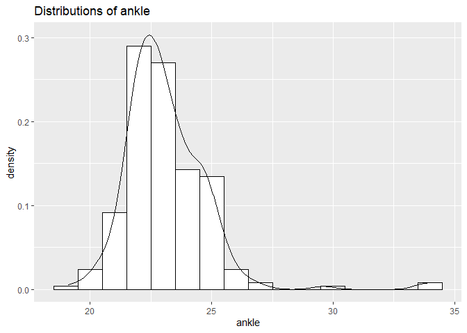
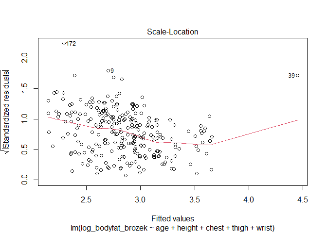
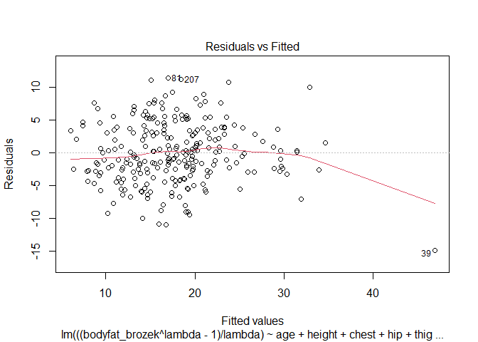
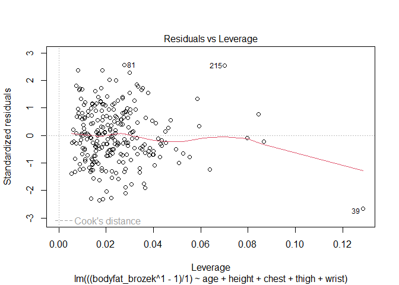

FinalProject
================
Group 30
2022-11-28

## R Markdown

### Appendix 1: Distribution of Data

``` r
Body_df = readxl::read_excel("data/body_density_data.xlsx")
summary(Body_df)
```

    ##        id         bodyfat_brozek   bodyfat_siri    body_density  
    ##  Min.   :  1.00   Min.   : 0.00   Min.   : 0.00   Min.   :0.995  
    ##  1st Qu.: 63.75   1st Qu.:12.80   1st Qu.:12.47   1st Qu.:1.041  
    ##  Median :126.50   Median :19.00   Median :19.20   Median :1.055  
    ##  Mean   :126.50   Mean   :18.94   Mean   :19.15   Mean   :1.056  
    ##  3rd Qu.:189.25   3rd Qu.:24.60   3rd Qu.:25.30   3rd Qu.:1.070  
    ##  Max.   :252.00   Max.   :45.10   Max.   :47.50   Max.   :1.109  
    ##       age            weight          height           neck      
    ##  Min.   :22.00   Min.   :118.5   Min.   :64.00   Min.   :31.10  
    ##  1st Qu.:35.75   1st Qu.:159.0   1st Qu.:68.25   1st Qu.:36.40  
    ##  Median :43.00   Median :176.5   Median :70.00   Median :38.00  
    ##  Mean   :44.88   Mean   :178.9   Mean   :70.31   Mean   :37.99  
    ##  3rd Qu.:54.00   3rd Qu.:197.0   3rd Qu.:72.25   3rd Qu.:39.42  
    ##  Max.   :81.00   Max.   :363.1   Max.   :77.75   Max.   :51.20  
    ##      chest           abdomen            hip            thigh      
    ##  Min.   : 79.30   Min.   : 69.40   Min.   : 85.0   Min.   :47.20  
    ##  1st Qu.: 94.35   1st Qu.: 84.58   1st Qu.: 95.5   1st Qu.:56.00  
    ##  Median : 99.65   Median : 90.95   Median : 99.3   Median :59.00  
    ##  Mean   :100.82   Mean   : 92.56   Mean   : 99.9   Mean   :59.41  
    ##  3rd Qu.:105.38   3rd Qu.: 99.33   3rd Qu.:103.5   3rd Qu.:62.35  
    ##  Max.   :136.20   Max.   :148.10   Max.   :147.7   Max.   :87.30  
    ##       knee           ankle          bicep          forearm          wrist      
    ##  Min.   :33.00   Min.   :19.1   Min.   :24.80   Min.   :21.00   Min.   :15.80  
    ##  1st Qu.:36.98   1st Qu.:22.0   1st Qu.:30.20   1st Qu.:27.30   1st Qu.:17.60  
    ##  Median :38.50   Median :22.8   Median :32.05   Median :28.70   Median :18.30  
    ##  Mean   :38.59   Mean   :23.1   Mean   :32.27   Mean   :28.66   Mean   :18.23  
    ##  3rd Qu.:39.92   3rd Qu.:24.0   3rd Qu.:34.33   3rd Qu.:30.00   3rd Qu.:18.80  
    ##  Max.   :49.10   Max.   :33.9   Max.   :45.00   Max.   :34.90   Max.   :21.40

``` r
#the data is all continuous so histogram

ggplot(Body_df, aes(x=bodyfat_brozek)) + 
 geom_histogram(aes(y=..density..), colour="black", fill="white",binwidth = 1)+
 geom_density(alpha=.2)+
 labs(title="Distributions of body fat measured in Brozek method")
```

    ## Warning: The dot-dot notation (`..density..`) was deprecated in ggplot2 3.4.0.
    ## ℹ Please use `after_stat(density)` instead.

<!-- -->

``` r
#define column names
colnames = colnames(Body_df)

# Predictor:
for (i in 5:length(colnames)){
  plot = 
ggplot(Body_df, aes_string(x=colnames[i])) + 
 geom_histogram(aes(y=..density..), colour="black", fill="white",binwidth = 1)+
 geom_density(alpha=.2)+
 labs(title=sprintf("Distributions of %s", colnames[i]) )
  
  print(plot)
}
```

    ## Warning: `aes_string()` was deprecated in ggplot2 3.0.0.
    ## ℹ Please use tidy evaluation ideoms with `aes()`

<!-- --><!-- --><!-- --><!-- --><!-- --><!-- --><!-- --><!-- --><!-- --><!-- --><!-- --><!-- --><!-- -->

### Appendix 2: Scatter Plot

``` r
for (i in 5:length(colnames)){
  plot = 
  Body_df %>% 
    ggplot(aes_string(x = colnames[i], y = "bodyfat_brozek"))+geom_point()+geom_smooth(method = 'lm', se = TRUE, color = 'red')+
    labs(title = sprintf("Scatter plot for body fat against %s", colnames[i]) )+
    ylab("Body Fat (Brozek)")
  
  print(plot)
}
```

<!-- --><!-- --><!-- --><!-- --><!-- --><!-- --><!-- --><!-- --><!-- --><!-- --><!-- --><!-- --><!-- -->

### Appendix 3: Variable Selection VIF

Using Backwards only

``` r
bodyfat_temp = 
  Body_df %>% 
  dplyr::select(-id,-bodyfat_siri,-body_density)
  
  
# Fit the full model 
Full_model <- lm(bodyfat_brozek ~., data = bodyfat_temp)

vif(Full_model)
```

    ##       age    weight    height      neck     chest   abdomen       hip     thigh 
    ##  2.224469 44.652515  2.939110  4.431923 10.234694 12.775528 14.541932  7.958662 
    ##      knee     ankle     bicep   forearm     wrist 
    ##  4.825304  1.924098  3.670907  2.191933  3.348404

``` r
bodyfat_noweight = 
  bodyfat_temp %>% 
  dplyr::select(-"weight")

Weight_removed_model <- lm(bodyfat_brozek ~., data = bodyfat_noweight)

vif(Weight_removed_model)
```

    ##       age    height      neck     chest   abdomen       hip     thigh      knee 
    ##  2.149879  1.751518  3.918583  7.900701 11.487439 10.748142  7.826186  4.771981 
    ##     ankle     bicep   forearm     wrist 
    ##  1.843908  3.502986  2.191809  3.281432

``` r
bodyfat_noabdweight=
  bodyfat_temp %>% 
  dplyr::select(-"weight",-"abdomen")

abd_weight_removed <- lm(bodyfat_brozek ~., data = bodyfat_noabdweight)
vif(abd_weight_removed)
```

    ##      age   height     neck    chest      hip    thigh     knee    ankle 
    ## 1.816176 1.719997 3.880221 5.021874 8.618196 7.705758 4.767768 1.838507 
    ##    bicep  forearm    wrist 
    ## 3.477993 2.186450 3.245301

### Appendix 3: Model Selection using backward with cv

``` r
bodyfat_temp =
  bodyfat_temp %>% 
  dplyr::select(-abdomen, -weight)


# Set seed for reproducibility
set.seed(123)
# Set up repeated k-fold cross-validation
train.control <- trainControl(method = "cv", number = 10)
# Train the model
step.model <- train(bodyfat_brozek ~., data = bodyfat_temp,
                    method = "leapBackward", 
                    tuneGrid = data.frame(nvmax = 1:5),
                    trControl = train.control
                    )
step.model$results
```

    ##   nvmax     RMSE  Rsquared      MAE    RMSESD RsquaredSD     MAESD
    ## 1     1 5.468315 0.5288855 4.523531 0.9194793 0.12128460 0.8115116
    ## 2     2 5.377016 0.5454165 4.428660 0.7152065 0.08759493 0.6323402
    ## 3     3 5.398589 0.5429588 4.382929 0.6759074 0.08195667 0.4612659
    ## 4     4 5.028840 0.5990729 4.079371 0.5089244 0.09092629 0.3450016
    ## 5     5 4.992419 0.6094073 4.042983 0.4709507 0.07305899 0.4010129

``` r
summary(step.model$finalModel)
```

    ## Subset selection object
    ## 11 Variables  (and intercept)
    ##         Forced in Forced out
    ## age         FALSE      FALSE
    ## height      FALSE      FALSE
    ## neck        FALSE      FALSE
    ## chest       FALSE      FALSE
    ## hip         FALSE      FALSE
    ## thigh       FALSE      FALSE
    ## knee        FALSE      FALSE
    ## ankle       FALSE      FALSE
    ## bicep       FALSE      FALSE
    ## forearm     FALSE      FALSE
    ## wrist       FALSE      FALSE
    ## 1 subsets of each size up to 5
    ## Selection Algorithm: backward
    ##          age height neck chest hip thigh knee ankle bicep forearm wrist
    ## 1  ( 1 ) " " " "    " "  "*"   " " " "   " "  " "   " "   " "     " "  
    ## 2  ( 1 ) "*" " "    " "  "*"   " " " "   " "  " "   " "   " "     " "  
    ## 3  ( 1 ) "*" " "    " "  "*"   " " " "   " "  " "   " "   " "     "*"  
    ## 4  ( 1 ) "*" " "    " "  "*"   " " "*"   " "  " "   " "   " "     "*"  
    ## 5  ( 1 ) "*" "*"    " "  "*"   " " "*"   " "  " "   " "   " "     "*"

``` r
Selected_lm_model = lm(bodyfat_brozek~age+height+chest+thigh+wrist, data = bodyfat_temp)

plot(Selected_lm_model)
```

<!-- --><!-- --><!-- --><!-- -->

``` r
summary(Selected_lm_model)
```

    ## 
    ## Call:
    ## lm(formula = bodyfat_brozek ~ age + height + chest + thigh + 
    ##     wrist, data = bodyfat_temp)
    ## 
    ## Residuals:
    ##      Min       1Q   Median       3Q      Max 
    ## -12.3090  -3.2423  -0.3298   3.3691  12.3696 
    ## 
    ## Coefficients:
    ##              Estimate Std. Error t value Pr(>|t|)    
    ## (Intercept) -13.61425    9.10014  -1.496   0.1359    
    ## age           0.18500    0.03064   6.039 5.70e-09 ***
    ## height       -0.31688    0.13825  -2.292   0.0227 *  
    ## chest         0.51363    0.06417   8.004 4.78e-14 ***
    ## thigh         0.58783    0.10137   5.799 2.04e-08 ***
    ## wrist        -2.20403    0.49329  -4.468 1.20e-05 ***
    ## ---
    ## Signif. codes:  0 '***' 0.001 '**' 0.01 '*' 0.05 '.' 0.1 ' ' 1
    ## 
    ## Residual standard error: 4.867 on 246 degrees of freedom
    ## Multiple R-squared:  0.6135, Adjusted R-squared:  0.6056 
    ## F-statistic: 78.09 on 5 and 246 DF,  p-value: < 2.2e-16

### Appendix 4 Log transformation

``` r
bodyfat_nonzero = 
  bodyfat_temp %>% 
  filter(bodyfat_brozek!=0) 

bodyfat_log = 
  bodyfat_nonzero %>% 
  mutate(log_bodyfat_brozek=log(bodyfat_brozek))
  
  
boxcox_lm_model = lm(log_bodyfat_brozek~age+height+chest+thigh+wrist, data = bodyfat_log)

plot(boxcox_lm_model)
```

<!-- --><!-- --><!-- --><!-- -->

``` r
summary(boxcox_lm_model)
```

    ## 
    ## Call:
    ## lm(formula = log_bodyfat_brozek ~ age + height + chest + thigh + 
    ##     wrist, data = bodyfat_log)
    ## 
    ## Residuals:
    ##      Min       1Q   Median       3Q      Max 
    ## -1.65063 -0.16862  0.01795  0.24979  0.62733 
    ## 
    ## Coefficients:
    ##              Estimate Std. Error t value Pr(>|t|)    
    ## (Intercept)  0.264440   0.630533   0.419  0.67530    
    ## age          0.013030   0.002115   6.160 2.96e-09 ***
    ## height      -0.007660   0.009543  -0.803  0.42294    
    ## chest        0.025465   0.004437   5.740 2.79e-08 ***
    ## thigh        0.040465   0.007004   5.778 2.29e-08 ***
    ## wrist       -0.133831   0.034048  -3.931  0.00011 ***
    ## ---
    ## Signif. codes:  0 '***' 0.001 '**' 0.01 '*' 0.05 '.' 0.1 ' ' 1
    ## 
    ## Residual standard error: 0.336 on 245 degrees of freedom
    ## Multiple R-squared:  0.5239, Adjusted R-squared:  0.5142 
    ## F-statistic: 53.93 on 5 and 245 DF,  p-value: < 2.2e-16

### Appendix 5 Box Cox

#### All

``` r
mylm_all = lm(bodyfat_brozek~., data = bodyfat_nonzero)
bc_mod_all = boxcox(mylm_all)
```

<!-- -->

``` r
lambda <- bc_mod_all$x[which.max(bc_mod_all$y)]

new_model_all <- lm(((bodyfat_brozek^lambda-1)/lambda) ~ ., data = bodyfat_nonzero)

stepsearch_coxall=step(new_model_all)
```

    ## Start:  AIC=790.12
    ## ((bodyfat_brozek^lambda - 1)/lambda) ~ age + height + neck + 
    ##     chest + hip + thigh + knee + ankle + bicep + forearm + wrist
    ## 
    ##           Df Sum of Sq    RSS    AIC
    ## - ankle    1      0.16 5312.1 788.12
    ## - knee     1      0.19 5312.1 788.13
    ## - bicep    1      0.41 5312.3 788.14
    ## - neck     1     38.98 5350.9 789.95
    ## <none>                 5311.9 790.12
    ## - forearm  1     46.98 5358.9 790.33
    ## - hip      1     99.90 5411.8 792.79
    ## - thigh    1    123.03 5435.0 793.86
    ## - height   1    138.28 5450.2 794.57
    ## - wrist    1    299.39 5611.3 801.88
    ## - chest    1    661.91 5973.8 817.59
    ## - age      1    746.29 6058.2 821.11
    ## 
    ## Step:  AIC=788.12
    ## ((bodyfat_brozek^lambda - 1)/lambda) ~ age + height + neck + 
    ##     chest + hip + thigh + knee + bicep + forearm + wrist
    ## 
    ##           Df Sum of Sq    RSS    AIC
    ## - knee     1      0.13 5312.2 786.13
    ## - bicep    1      0.41 5312.5 786.14
    ## - neck     1     38.82 5350.9 787.95
    ## <none>                 5312.1 788.12
    ## - forearm  1     47.10 5359.2 788.34
    ## - hip      1     99.75 5411.8 790.79
    ## - thigh    1    123.11 5435.2 791.87
    ## - height   1    138.73 5450.8 792.60
    ## - wrist    1    329.55 5641.6 801.23
    ## - chest    1    661.85 5973.9 815.60
    ## - age      1    776.89 6089.0 820.38
    ## 
    ## Step:  AIC=786.13
    ## ((bodyfat_brozek^lambda - 1)/lambda) ~ age + height + neck + 
    ##     chest + hip + thigh + bicep + forearm + wrist
    ## 
    ##           Df Sum of Sq    RSS    AIC
    ## - bicep    1      0.42 5312.6 784.15
    ## - neck     1     39.58 5351.8 785.99
    ## <none>                 5312.2 786.13
    ## - forearm  1     47.80 5360.0 786.38
    ## - hip      1    104.72 5416.9 789.03
    ## - thigh    1    142.07 5454.3 790.75
    ## - height   1    160.85 5473.1 791.62
    ## - wrist    1    335.78 5648.0 799.51
    ## - chest    1    666.49 5978.7 813.80
    ## - age      1    831.58 6143.8 820.63
    ## 
    ## Step:  AIC=784.15
    ## ((bodyfat_brozek^lambda - 1)/lambda) ~ age + height + neck + 
    ##     chest + hip + thigh + forearm + wrist
    ## 
    ##           Df Sum of Sq    RSS    AIC
    ## - neck     1     41.51 5354.2 784.10
    ## <none>                 5312.6 784.15
    ## - forearm  1     49.81 5362.4 784.49
    ## - hip      1    105.28 5417.9 787.08
    ## - thigh    1    149.59 5462.2 789.12
    ## - height   1    161.09 5473.7 789.65
    ## - wrist    1    340.01 5652.6 797.72
    ## - chest    1    677.20 5989.8 812.26
    ## - age      1    831.95 6144.6 818.67
    ## 
    ## Step:  AIC=784.1
    ## ((bodyfat_brozek^lambda - 1)/lambda) ~ age + height + chest + 
    ##     hip + thigh + forearm + wrist
    ## 
    ##           Df Sum of Sq    RSS    AIC
    ## - forearm  1     36.91 5391.1 783.83
    ## <none>                 5354.2 784.10
    ## - hip      1    107.48 5461.6 787.09
    ## - thigh    1    128.54 5482.7 788.06
    ## - height   1    167.25 5521.4 789.82
    ## - wrist    1    497.30 5851.5 804.40
    ## - chest    1    639.67 5993.8 810.43
    ## - age      1    813.35 6167.5 817.60
    ## 
    ## Step:  AIC=783.83
    ## ((bodyfat_brozek^lambda - 1)/lambda) ~ age + height + chest + 
    ##     hip + thigh + wrist
    ## 
    ##          Df Sum of Sq    RSS    AIC
    ## <none>                5391.1 783.83
    ## - hip     1     91.48 5482.5 786.05
    ## - thigh   1    156.24 5547.3 789.00
    ## - height  1    157.70 5548.8 789.07
    ## - wrist   1    461.81 5852.9 802.46
    ## - chest   1    775.28 6166.3 815.55
    ## - age     1    776.84 6167.9 815.62

``` r
step_cox = lm(formula = ((bodyfat_brozek^lambda - 1)/lambda) ~ age + height + chest + 
    hip + thigh + wrist, data = bodyfat_nonzero)

plot(step_cox)
```

<!-- --><!-- --><!-- --><!-- -->

``` r
summary(step_cox)
```

    ## 
    ## Call:
    ## lm(formula = ((bodyfat_brozek^lambda - 1)/lambda) ~ age + height + 
    ##     chest + hip + thigh + wrist, data = bodyfat_nonzero)
    ## 
    ## Residuals:
    ##      Min       1Q   Median       3Q      Max 
    ## -14.9322  -2.9037  -0.1495   3.4429  11.4526 
    ## 
    ## Coefficients:
    ##              Estimate Std. Error t value Pr(>|t|)    
    ## (Intercept) -13.52106    8.82185  -1.533  0.12665    
    ## age           0.17578    0.02964   5.930 1.03e-08 ***
    ## height       -0.36438    0.13639  -2.672  0.00806 ** 
    ## chest         0.42296    0.07140   5.924 1.07e-08 ***
    ## hip           0.24046    0.11817   2.035  0.04295 *  
    ## thigh         0.36837    0.13853   2.659  0.00835 ** 
    ## wrist        -2.17974    0.47678  -4.572 7.69e-06 ***
    ## ---
    ## Signif. codes:  0 '***' 0.001 '**' 0.01 '*' 0.05 '.' 0.1 ' ' 1
    ## 
    ## Residual standard error: 4.7 on 244 degrees of freedom
    ## Multiple R-squared:  0.6116, Adjusted R-squared:  0.602 
    ## F-statistic: 64.03 on 6 and 244 DF,  p-value: < 2.2e-16

``` r
AIC(step_cox)
```

    ## [1] 1498.135

``` r
#lambda = 1 case
step_cox_1 = lm(formula = ((bodyfat_brozek^1 - 1)/1) ~ age + height + chest + 
    hip + thigh + wrist, data = bodyfat_nonzero)

plot(step_cox_1)
```

<!-- --><!-- --><!-- --><!-- -->

``` r
summary(step_cox_1)
```

    ## 
    ## Call:
    ## lm(formula = ((bodyfat_brozek^1 - 1)/1) ~ age + height + chest + 
    ##     hip + thigh + wrist, data = bodyfat_nonzero)
    ## 
    ## Residuals:
    ##     Min      1Q  Median      3Q     Max 
    ## -15.367  -2.988  -0.175   3.539  11.807 
    ## 
    ## Coefficients:
    ##              Estimate Std. Error t value Pr(>|t|)    
    ## (Intercept) -13.96005    9.07924  -1.538  0.12545    
    ## age           0.18070    0.03051   5.923 1.07e-08 ***
    ## height       -0.37730    0.14037  -2.688  0.00768 ** 
    ## chest         0.43577    0.07349   5.930 1.03e-08 ***
    ## hip           0.24950    0.12162   2.051  0.04129 *  
    ## thigh         0.37699    0.14257   2.644  0.00872 ** 
    ## wrist        -2.24486    0.49069  -4.575 7.59e-06 ***
    ## ---
    ## Signif. codes:  0 '***' 0.001 '**' 0.01 '*' 0.05 '.' 0.1 ' ' 1
    ## 
    ## Residual standard error: 4.838 on 244 degrees of freedom
    ## Multiple R-squared:  0.612,  Adjusted R-squared:  0.6025 
    ## F-statistic: 64.16 on 6 and 244 DF,  p-value: < 2.2e-16

``` r
AIC(step_cox_1)
```

    ## [1] 1512.572

#### Partial

``` r
#chosen from previous model 

mylm = lm(bodyfat_brozek~age+height+chest+thigh+wrist, data = bodyfat_nonzero)
bc_mod = boxcox(mylm)
```

<!-- -->

``` r
lambda <- bc_mod$x[which.max(bc_mod$y)]

new_model <- lm(((bodyfat_brozek^lambda-1)/lambda) ~ age+height+chest+thigh+wrist, data = bodyfat_nonzero)

plot(new_model)
```

<!-- --><!-- --><!-- --><!-- -->

``` r
summary(new_model)
```

    ## 
    ## Call:
    ## lm(formula = ((bodyfat_brozek^lambda - 1)/lambda) ~ age + height + 
    ##     chest + thigh + wrist, data = bodyfat_nonzero)
    ## 
    ## Residuals:
    ##      Min       1Q   Median       3Q      Max 
    ## -10.5924  -2.8560  -0.2488   2.9058  10.5763 
    ## 
    ## Coefficients:
    ##              Estimate Std. Error t value Pr(>|t|)    
    ## (Intercept) -11.82663    7.91174  -1.495   0.1362    
    ## age           0.16048    0.02654   6.047 5.48e-09 ***
    ## height       -0.26805    0.11974  -2.238   0.0261 *  
    ## chest         0.43734    0.05567   7.856 1.25e-13 ***
    ## thigh         0.50761    0.08788   5.776 2.31e-08 ***
    ## wrist        -1.90332    0.42723  -4.455 1.28e-05 ***
    ## ---
    ## Signif. codes:  0 '***' 0.001 '**' 0.01 '*' 0.05 '.' 0.1 ' ' 1
    ## 
    ## Residual standard error: 4.216 on 245 degrees of freedom
    ## Multiple R-squared:  0.6035, Adjusted R-squared:  0.5954 
    ## F-statistic: 74.58 on 5 and 245 DF,  p-value: < 2.2e-16

``` r
AIC(new_model)
```

    ## [1] 1442.506

``` r
#lambda = 1 case
new_model_1 <- lm(((bodyfat_brozek^1-1)/1) ~ age+height+chest+thigh+wrist, data = bodyfat_nonzero)

plot(new_model_1)
```

<!-- --><!-- --><!-- --><!-- -->

``` r
summary(new_model_1)
```

    ## 
    ## Call:
    ## lm(formula = ((bodyfat_brozek^1 - 1)/1) ~ age + height + chest + 
    ##     thigh + wrist, data = bodyfat_nonzero)
    ## 
    ## Residuals:
    ##     Min      1Q  Median      3Q     Max 
    ## -12.093  -3.232  -0.357   3.329  12.331 
    ## 
    ## Coefficients:
    ##              Estimate Std. Error t value Pr(>|t|)    
    ## (Intercept) -13.88856    9.13843  -1.520   0.1299    
    ## age           0.18441    0.03065   6.016 6.48e-09 ***
    ## height       -0.31853    0.13831  -2.303   0.0221 *  
    ## chest         0.51027    0.06430   7.936 7.50e-14 ***
    ## thigh         0.58374    0.10150   5.751 2.63e-08 ***
    ## wrist        -2.20318    0.49347  -4.465 1.22e-05 ***
    ## ---
    ## Signif. codes:  0 '***' 0.001 '**' 0.01 '*' 0.05 '.' 0.1 ' ' 1
    ## 
    ## Residual standard error: 4.869 on 245 degrees of freedom
    ## Multiple R-squared:  0.6054, Adjusted R-squared:  0.5973 
    ## F-statistic: 75.16 on 5 and 245 DF,  p-value: < 2.2e-16

``` r
AIC(new_model_1)
```

    ## [1] 1514.865

### Appendix 6 Pairwise

``` r
lm0 = lm(bodyfat_brozek~age+height+chest+thigh+wrist, data = bodyfat_temp)

stepsearch = step(lm0,~.^2)
```

    ## Start:  AIC=803.54
    ## bodyfat_brozek ~ age + height + chest + thigh + wrist
    ## 
    ##                Df Sum of Sq    RSS    AIC
    ## + thigh:wrist   1    282.21 5546.1 793.04
    ## + height:chest  1    246.75 5581.5 794.64
    ## + chest:thigh   1    232.34 5595.9 795.29
    ## + age:wrist     1    214.39 5613.9 796.10
    ## + height:thigh  1    182.79 5645.5 797.51
    ## + height:wrist  1    148.88 5679.4 799.02
    ## + chest:wrist   1    101.78 5726.5 801.10
    ## + age:chest     1     55.97 5772.3 803.11
    ## <none>                      5828.3 803.54
    ## + age:height    1     19.91 5808.3 804.68
    ## + age:thigh     1      0.35 5827.9 805.53
    ## - height        1    124.47 5952.7 806.87
    ## - wrist         1    472.97 6301.2 821.21
    ## - thigh         1    796.75 6625.0 833.83
    ## - age           1    863.93 6692.2 836.38
    ## - chest         1   1517.71 7346.0 859.86
    ## 
    ## Step:  AIC=793.04
    ## bodyfat_brozek ~ age + height + chest + thigh + wrist + thigh:wrist
    ## 
    ##                Df Sum of Sq    RSS    AIC
    ## + age:wrist     1    168.99 5377.1 787.24
    ## + height:chest  1     96.35 5449.7 790.62
    ## + chest:wrist   1     76.86 5469.2 791.52
    ## + age:chest     1     51.13 5494.9 792.70
    ## + height:wrist  1     46.35 5499.7 792.92
    ## <none>                      5546.1 793.04
    ## + height:thigh  1     37.72 5508.3 793.32
    ## + age:height    1     19.51 5526.5 794.15
    ## + age:thigh     1      5.23 5540.8 794.80
    ## + chest:thigh   1      0.78 5545.3 795.00
    ## - height        1    167.89 5713.9 798.55
    ## - thigh:wrist   1    282.21 5828.3 803.54
    ## - age           1    745.59 6291.6 822.82
    ## - chest         1   1581.57 7127.6 854.26
    ## 
    ## Step:  AIC=787.24
    ## bodyfat_brozek ~ age + height + chest + thigh + wrist + thigh:wrist + 
    ##     age:wrist
    ## 
    ##                Df Sum of Sq    RSS    AIC
    ## + height:chest  1     99.81 5277.3 784.52
    ## <none>                      5377.1 787.24
    ## + height:wrist  1     28.25 5348.8 787.91
    ## + age:thigh     1     19.48 5357.6 788.32
    ## + height:thigh  1     16.06 5361.0 788.48
    ## + chest:thigh   1      8.35 5368.7 788.85
    ## + chest:wrist   1      4.34 5372.7 789.03
    ## + age:chest     1      1.50 5375.6 789.17
    ## + age:height    1      0.24 5376.8 789.23
    ## - height        1    159.24 5536.3 792.59
    ## - age:wrist     1    168.99 5546.1 793.04
    ## - thigh:wrist   1    236.80 5613.9 796.10
    ## - chest         1   1449.65 6826.7 845.39
    ## 
    ## Step:  AIC=784.52
    ## bodyfat_brozek ~ age + height + chest + thigh + wrist + thigh:wrist + 
    ##     age:wrist + height:chest
    ## 
    ##                Df Sum of Sq    RSS    AIC
    ## <none>                      5277.3 784.52
    ## + age:thigh     1    30.846 5246.4 785.04
    ## + chest:wrist   1    16.398 5260.9 785.73
    ## + age:chest     1    12.466 5264.8 785.92
    ## + height:thigh  1     9.600 5267.7 786.06
    ## + chest:thigh   1     6.724 5270.5 786.20
    ## + age:height    1     5.523 5271.7 786.25
    ## + height:wrist  1     1.721 5275.5 786.43
    ## - height:chest  1    99.812 5377.1 787.24
    ## - thigh:wrist   1   102.600 5379.9 787.37
    ## - age:wrist     1   172.448 5449.7 790.62

``` r
lm_pairwise = lm(bodyfat_brozek~age + height + chest + thigh + wrist + thigh:wrist + 
    age:wrist + height:chest, data = bodyfat_temp)

plot(lm_pairwise)
```

<!-- --><!-- --><!-- --><!-- -->

``` r
summary(lm_pairwise)
```

    ## 
    ## Call:
    ## lm(formula = bodyfat_brozek ~ age + height + chest + thigh + 
    ##     wrist + thigh:wrist + age:wrist + height:chest, data = bodyfat_temp)
    ## 
    ## Residuals:
    ##      Min       1Q   Median       3Q      Max 
    ## -11.9203  -3.0926  -0.1179   3.1289  14.5729 
    ## 
    ## Coefficients:
    ##                Estimate Std. Error t value Pr(>|t|)   
    ## (Intercept)  -278.90627   99.32351  -2.808  0.00539 **
    ## age            -1.19558    0.48857  -2.447  0.01511 * 
    ## height          2.82924    1.49395   1.894  0.05944 . 
    ## chest           2.67984    1.01599   2.638  0.00889 **
    ## thigh           2.41728    0.81291   2.974  0.00324 **
    ## wrist           0.14085    3.04504   0.046  0.96315   
    ## thigh:wrist    -0.09552    0.04395  -2.174  0.03070 * 
    ## age:wrist       0.07514    0.02667   2.818  0.00523 **
    ## height:chest   -0.03126    0.01458  -2.144  0.03304 * 
    ## ---
    ## Signif. codes:  0 '***' 0.001 '**' 0.01 '*' 0.05 '.' 0.1 ' ' 1
    ## 
    ## Residual standard error: 4.66 on 243 degrees of freedom
    ## Multiple R-squared:   0.65,  Adjusted R-squared:  0.6385 
    ## F-statistic: 56.42 on 8 and 243 DF,  p-value: < 2.2e-16

### Appendix 7 Square term

``` r
square_lm = lm(bodyfat_brozek ~ poly(age,2)+poly(height,2)+poly(chest,2)+poly(thigh, 2)+poly(wrist,2), data=Body_df)

step(square_lm)
```

    ## Start:  AIC=799.14
    ## bodyfat_brozek ~ poly(age, 2) + poly(height, 2) + poly(chest, 
    ##     2) + poly(thigh, 2) + poly(wrist, 2)
    ## 
    ##                   Df Sum of Sq    RSS    AIC
    ## <none>                         5504.5 799.14
    ## - poly(height, 2)  2    184.30 5688.8 803.44
    ## - poly(wrist, 2)   2    515.73 6020.2 817.71
    ## - poly(age, 2)     2    848.38 6352.8 831.26
    ## - poly(thigh, 2)   2    918.76 6423.2 834.04
    ## - poly(chest, 2)   2   1428.67 6933.1 853.29

    ## 
    ## Call:
    ## lm(formula = bodyfat_brozek ~ poly(age, 2) + poly(height, 2) + 
    ##     poly(chest, 2) + poly(thigh, 2) + poly(wrist, 2), data = Body_df)
    ## 
    ## Coefficients:
    ##      (Intercept)     poly(age, 2)1     poly(age, 2)2  poly(height, 2)1  
    ##           18.938            36.904             2.800           -14.650  
    ## poly(height, 2)2   poly(chest, 2)1   poly(chest, 2)2   poly(thigh, 2)1  
    ##           -5.643            67.808            -3.565            49.968  
    ##  poly(thigh, 2)2   poly(wrist, 2)1   poly(wrist, 2)2  
    ##          -17.493           -33.312             8.075

``` r
#square_lm_adpt = lm(bodyfat_brozek~poly(abdomen, 2) + poly(wrist, 2) + poly(weight,2),data=Body_df)

plot(square_lm)
```

<!-- --><!-- --><!-- --><!-- -->

``` r
summary(square_lm)
```

    ## 
    ## Call:
    ## lm(formula = bodyfat_brozek ~ poly(age, 2) + poly(height, 2) + 
    ##     poly(chest, 2) + poly(thigh, 2) + poly(wrist, 2), data = Body_df)
    ## 
    ## Residuals:
    ##      Min       1Q   Median       3Q      Max 
    ## -11.5169  -2.9821  -0.3791   3.1701  13.3441 
    ## 
    ## Coefficients:
    ##                  Estimate Std. Error t value Pr(>|t|)    
    ## (Intercept)       18.9385     0.3011  62.907  < 2e-16 ***
    ## poly(age, 2)1     36.9042     6.0554   6.094 4.32e-09 ***
    ## poly(age, 2)2      2.8001     4.9087   0.570   0.5689    
    ## poly(height, 2)1 -14.6495     5.7187  -2.562   0.0110 *  
    ## poly(height, 2)2  -5.6425     4.8513  -1.163   0.2459    
    ## poly(chest, 2)1   67.8080     8.5754   7.907 9.45e-14 ***
    ## poly(chest, 2)2   -3.5648     7.2561  -0.491   0.6237    
    ## poly(thigh, 2)1   49.9681     8.3728   5.968 8.53e-09 ***
    ## poly(thigh, 2)2  -17.4930     6.9165  -2.529   0.0121 *  
    ## poly(wrist, 2)1  -33.3120     7.3319  -4.543 8.76e-06 ***
    ## poly(wrist, 2)2    8.0752     6.1242   1.319   0.1886    
    ## ---
    ## Signif. codes:  0 '***' 0.001 '**' 0.01 '*' 0.05 '.' 0.1 ' ' 1
    ## 
    ## Residual standard error: 4.779 on 241 degrees of freedom
    ## Multiple R-squared:  0.635,  Adjusted R-squared:  0.6198 
    ## F-statistic: 41.92 on 10 and 241 DF,  p-value: < 2.2e-16

### Appendix 8 GLM

``` r
myglm1 = glm(bodyfat_brozek~., data = bodyfat_temp,family=gaussian)
stepsearch_glm1 = step(myglm1)
```

    ## Start:  AIC=1524.68
    ## bodyfat_brozek ~ age + height + neck + chest + hip + thigh + 
    ##     knee + ankle + bicep + forearm + wrist
    ## 
    ##           Df Deviance    AIC
    ## - ankle    1   5646.0 1522.7
    ## - knee     1   5646.1 1522.7
    ## - bicep    1   5647.0 1522.7
    ## - neck     1   5690.0 1524.6
    ## <none>         5645.9 1524.7
    ## - forearm  1   5699.7 1525.1
    ## - hip      1   5748.4 1527.2
    ## - thigh    1   5785.9 1528.8
    ## - height   1   5791.2 1529.1
    ## - wrist    1   5961.6 1536.4
    ## - chest    1   6378.2 1553.4
    ## - age      1   6445.5 1556.1
    ## 
    ## Step:  AIC=1522.68
    ## bodyfat_brozek ~ age + height + neck + chest + hip + thigh + 
    ##     knee + bicep + forearm + wrist
    ## 
    ##           Df Deviance    AIC
    ## - knee     1   5646.1 1520.7
    ## - bicep    1   5647.1 1520.7
    ## - neck     1   5690.0 1522.6
    ## <none>         5646.0 1522.7
    ## - forearm  1   5699.9 1523.1
    ## - hip      1   5748.4 1525.2
    ## - thigh    1   5786.0 1526.9
    ## - height   1   5791.7 1527.1
    ## - wrist    1   5992.1 1535.7
    ## - chest    1   6378.5 1551.4
    ## - age      1   6476.7 1555.3
    ## 
    ## Step:  AIC=1520.69
    ## bodyfat_brozek ~ age + height + neck + chest + hip + thigh + 
    ##     bicep + forearm + wrist
    ## 
    ##           Df Deviance    AIC
    ## - bicep    1   5647.2 1518.7
    ## - neck     1   5690.9 1520.7
    ## <none>         5646.1 1520.7
    ## - forearm  1   5700.7 1521.1
    ## - hip      1   5753.5 1523.4
    ## - thigh    1   5807.2 1525.8
    ## - height   1   5815.6 1526.1
    ## - wrist    1   5999.1 1534.0
    ## - chest    1   6383.4 1549.6
    ## - age      1   6534.4 1555.5
    ## 
    ## Step:  AIC=1518.73
    ## bodyfat_brozek ~ age + height + neck + chest + hip + thigh + 
    ##     forearm + wrist
    ## 
    ##           Df Deviance    AIC
    ## <none>         5647.2 1518.7
    ## - neck     1   5694.9 1518.8
    ## - forearm  1   5702.3 1519.2
    ## - hip      1   5755.2 1521.5
    ## - thigh    1   5813.8 1524.1
    ## - height   1   5817.0 1524.2
    ## - wrist    1   6005.5 1532.2
    ## - chest    1   6392.4 1548.0
    ## - age      1   6536.2 1553.6

``` r
Guassian_opt_glm = glm(formula = bodyfat_brozek ~ age + height + neck + chest + hip + thigh + 
    forearm + wrist, family = gaussian, data = bodyfat_temp)

plot(Guassian_opt_glm)
```

<!-- --><!-- --><!-- --><!-- -->

``` r
summary(Guassian_opt_glm)
```

    ## 
    ## Call:
    ## glm(formula = bodyfat_brozek ~ age + height + neck + chest + 
    ##     hip + thigh + forearm + wrist, family = gaussian, data = bodyfat_temp)
    ## 
    ## Deviance Residuals: 
    ##      Min        1Q    Median        3Q       Max  
    ## -12.6928   -3.0469   -0.4239    3.4936   12.2914  
    ## 
    ## Coefficients:
    ##              Estimate Std. Error t value Pr(>|t|)    
    ## (Intercept) -14.51162    9.07334  -1.599 0.111038    
    ## age           0.19180    0.03101   6.185 2.61e-09 ***
    ## height       -0.37904    0.14023  -2.703 0.007357 ** 
    ## neck         -0.34745    0.24258  -1.432 0.153335    
    ## chest         0.45174    0.07977   5.663 4.19e-08 ***
    ## hip           0.26387    0.12238   2.156 0.032053 *  
    ## thigh         0.38956    0.14547   2.678 0.007914 ** 
    ## forearm       0.32552    0.21129   1.541 0.124706    
    ## wrist        -2.17719    0.55443  -3.927 0.000112 ***
    ## ---
    ## Signif. codes:  0 '***' 0.001 '**' 0.01 '*' 0.05 '.' 0.1 ' ' 1
    ## 
    ## (Dispersion parameter for gaussian family taken to be 23.2394)
    ## 
    ##     Null deviance: 15079.0  on 251  degrees of freedom
    ## Residual deviance:  5647.2  on 243  degrees of freedom
    ## AIC: 1518.7
    ## 
    ## Number of Fisher Scoring iterations: 2
